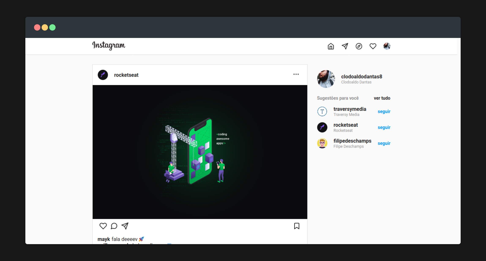

## Instagram Clone

> clone da versão web do instagram



## :fire: Instalação

```bash
yarn install # or npm install
yarn serve # or npm run serve
```

## :memo: Licença

Este projeto está sob a licença MIT. Veja o arquivo [LICENSE](LICENSE) para mais detalhes.
